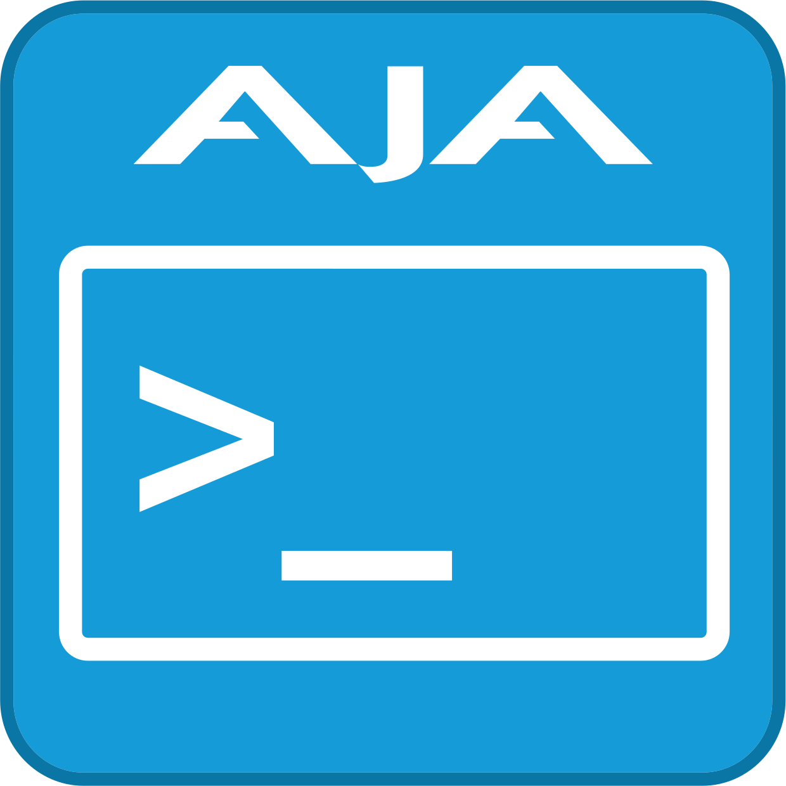

<p align="center">
  <a href="https://www.aja.com/">
    
  </a>
</p>

<h1 style="text-align: center;">libajantv2</h1>

This is the open-source SDK for discovering, interrogating and controlling NTV2 professional video I/O devices from AJA Video Systems, Inc. All code herein is licensed under the MIT license.

> **NOTE:**\
> Only the “release” branch has ongoing support from AJA Video Systems, Inc.\
> Starting with v17.1, official releases are tagged from the “release” branch.\
> The “main” branch should be considered unstable, and is for ongoing development.

# Table of Contents
1. [Directory Layout](#directory-layout)
1. [Documentation](#documentation)
1. [Obtaining ‘libajantv2’](#obtaining-libajantv2)
1. [Building ‘libajantv2’](#building-libajantv2)
1. [Building the NTV2 Device Driver](#building-driver)
1. [Verifying the NTV2 Device Driver](#verifying-driver)
1. [SDK Forward & Backward Compatibility](#fwdbackcompatibility)
1. [SDK & Driver Compatibility](#drivercompat)
1. [Firmware and Device Features](#fwdevicefeatures)
1. [‘libajantv2’ Dynamic (Shared) Libary](#dynamiclib)

## Directory Layout
The **libajantv2** folder contains the following items:
- **ajaanc** — Classes for encoding & decoding SDI ancillary data packets.
- **ajabase** — Utility classes (e.g. threads, mutexes, files, etc.).
- **ajantv2** — Principal classes, especially **CNTV2Card**.
  - **includes** — Header files.
  - **src** — Source files.
  - **test** — Unit test source code.
  - **utilityfiles** — Additional sources needed to build some command-line utilities.
- **ci** — Continuous integration (CI) scripts.
- **cmake** — Cmake build-related stuff.
- **container** — Docker-related stuff.
- **demos** — Demonstration programs and applications.
- **driver** — Platform-specific device drivers.
- **plugins** — Dynamically-loadable libraries that augment SDK behavior.
- **thirdparty** — Required non-AJA packages (e.g. **doctest**)
- **tools** — Useful command-line utilities.

## Obtaining libajantv2 <a name="obtaining-libajantv2"></a>

Clone the libajantv2 repository from GitHub:
```
> git clone git@github.com:aja-video/libajantv2.git
```

## Documentation

* You can access our SDK documentation by going to [sdkdocs.aja.com](https://sdkdocs.aja.com/).
 * Source: https://github.com/aja-video/aja-video.github.io
* For registered OEMs, you can gain access to past SDK downloads as well as other specific how-to's from the [SDK Support portal](https://sdksupport.aja.com/).

## Building libajantv2 <a name="building-libajantv2"></a>
Starting in the NTV2 SDK version 17.0, AJA has standardized on [CMake](https://cmake.org/) for describing how to build the libraries, demonstration applications, command-line tools, unit tests, and plugins. AJA requires CMake version 3.15 or later.

The instructions for building the default static library are generally the same on each supported platform (Windows, macOS, Linux). Note that the default "CMake Generator" varies by platform.

> **NOTE:**\
> By default — absent any parameters — all standard targets are built (static library, demos, tools, tests, plugins).

To prevent building certain targets, these CMake variables can be set to `ON` in your CMake build environment:
- `AJANTV2_DISABLE_DEMOS` — If `ON`, prevents building the demonstration programs (e.g. **ntv2capture**, **ntv2player**, …).\
Demo apps are normally built by default.
- `AJANTV2_DISABLE_DRIVER` — If `ON`, prevents building the driver (Linux only).\
Building the driver is enabled by default for Linux
- `AJANTV2_DISABLE_TOOLS` — If `ON`, prevents building the command-line tools (e.g. **ntv2thermo**, **regio**, **supportlog**, …).\
Command-line tools are normally built by default.
- `AJANTV2_DISABLE_TESTS` — If `ON`, prevents building the unit test(s).\
The test programs are normally built by default.
- `AJANTV2_DISABLE_PLUGIN_LOAD` — If `ON`, prevents the NTV2 library from loading plugins (and also eliminates the dependency on the third-party `mbedtls` library).\
The default is `OFF`, which includes the `mbedtls` library depdendency and the ability to load AJA-signed plugins.
- `AJANTV2_DISABLE_CONFIGURE_VERSION_FILE` - If `ON`, prevents recreating the `ntv2version.h` file if it's already been created. This may be useful for some developers who don't wish to rebuild their project upon each configure of `libajantv2`. 

Please follow the instructions below to build `libajantv2` on the supported platform and development environment of your preference.

### Windows
  <details><summary>Command-line build instructions:</summary>

  1. Open a command prompt window (`cmd`) and initialize your Visual Studio environment by running the `vcvarsall.cmd` script from the desired Microsoft Visual Studio directory. The location of `vcvarsall.cmd` may vary depending on the version of Visual Studio installed on the development system.

     For example, if using **Visual Studio 2019 Community Edition**:
     ```
     > SET VS_YEAR=2019
     > SET VS_EDITION=Community
     > call "C:\Program Files (x86)\Microsoft Visual Studio\%VS_YEAR%\%VS_EDITION%\VC\Auxiliary\Build\vcvarsall.bat" x64
     ```
  1. Run `cmake` to generate the `libajantv2` Visual Studio Solution file in a directory called `build`:
     ```
     > cd libajantv2
     > cmake -S . -B build
     ```
  1. Build `libajantv2` from the command line, via the generated Visual Studio Solution:
     ```
     > cmake --build build
     ```
  1. If the build completes without errors, the static library should be in `out\build\<arch>-<build type>\ajantv2` under the `libajantv2` directory.

     Other build target outputs (demos, tools, etc.) will be available in subdirectories under the build directory mirroring their original location in the `libajantv2` source tree.

     For example, the `ntv2enumerateboards.exe` demo app will be located in: `out\build\demos\ntv2enumerateboards`.
   
  Alternatively, the generated Visual Studio solution from `build/libajantv2.sln` may be opened in Visual Studio, where `libajantv2` can be built via the usual mechanisms.

  </details>

  <details><summary>Visual Studio 2019 (or later) IDE:</summary>

  1. Open Microsoft Visual Studio 2019 (or later).
  1. From the initial splash page, select “**Open a local folder…**” and navigate to the `libajantv2` repo directory.
  1. If CMake is installed and configured properly, the **Output** window should show the CMake configuration logs and end with a message saying “CMake generation finished”.
  1. To reconfigure the build with custom settings for certain CMake variables, additional CMake or build flags, etc. choose “**CMake settings for libajantv2**” from the **Project** menu. Make any changes to the build flags, CMake flags, variables, etc. and then save the `CMakeSettings.json` document. The CMake configuration step should automatically re-run upon saving.

     **NOTE:**\
     To manually re-run the CMake configure step with new settings, choose “**Configure libajantv2**” from the **Project** menu. If you’ve added `libajantv2` as a sub-folder in another project you may see a different project name in the **Configure** menu item.
  1. Choose **Build All** from the **Build** menu.
  1. If the build completes without errors, the static library should be in `out\build\<arch>-<build type>\ajantv2` under the `libajantv2` directory.

     Other build target outputs (demos, tools, etc.) will be available in subdirectories under the build directory mirroring their original location in the `libajantv2` source tree.

     For example, the `ntv2enumerateboards.exe` demo app will be located in `out\build\demos\ntv2enumerateboards`.

  </details>


### macOS
  <details><summary>CMake Xcode Project Generation:</summary>

 1. Open a **Terminal** window, and generate the XCode project files:
     ```
     $ cd libajantv2
     $ cmake  -S .  -B build  -G Xcode
     ```
     **NOTE:**\
     CMake supports universal `arm64|x86_64` architecture binaries through the [`CMAKE_OSX_ARCITECTURES`](https://cmake.org/cmake/help/latest/variable/CMAKE_OSX_ARCHITECTURES.html) property. For example:
     ```
     $ cmake -S . -B bld-arm -G Xcode -DCMAKE_OSX_ARCHITECTURES=arm64
     $ cmake -S . -B bld-x86 -G Xcode -DCMAKE_OSX_ARCHITECTURES=x86_64
     $ cmake -S . -B bld-fat -G Xcode -DCMAKE_OSX_ARCHITECTURES=arm64;x86_64
     ```

 1. Build the `libajantv2` static library from the **Terminal**, via the generated XCode Project:
     ```
     $ cmake --build build
     ```

     **NOTE:**\
     It is also possible to build the generated XCode Project via the typical `xcrun` command:
     ```
     $ xcrun xcodebuild -project build/libajantv2.xcodeproj -target ALL_BUILD
     ```
 1. If the build completes without errors, the static library should be in `build/ajantv2/<Debug|Release>/libajantv2d.a` in the `libajantv2` directory.

     Other build target outputs (demos, tools, etc.) will be available in subdirectories under the build directory mirroring their original location in the libajantv2 source tree.

     For example, the `ntv2enumerateboards` demo app will be located in: `build/demos/ntv2enumerateboards`.

     Alternatively, the generated XCode project `build/libajantv2.xcodeproj` can be opened in **Xcode**, where the static library can be built via the usual mechanisms.
  </details>

### macOS and Linux
  <details><summary>GNU Makefile Generation:</summary>

 1. Open a terminal window and run `cmake` to generate the GNU Makefiles in a directory called `build`.
     ```
     $ cd libajantv2
     $ cmake -S . -B build
     ```
 2. Build the `libajantv2` static library from the generated GNU Makefiles:
     ```
     $ cmake --build build
     ```
 3. If the build completes without errors, the static library should be in `out\build\<arch>-<build type>\ajantv2` under the `libajantv2` directory.

    Other build target outputs (demos, tools, etc.) will be available in subdirectories under the build directory mirroring their original location in the `libajantv2` source tree.

    For example, the `ntv2enumerateboards` demo app will be located in `out\build\demos\ntv2enumerateboards`.
  </details>

### All Platforms
  <details><summary>Ninja Build:</summary>

  If Ninja Build is installed in the `PATH` it is possible to generate `.ninja` build configuration files with CMake.

  Ninja Build is available from GitHub, or via the package manager of your preference.

  Download: https://github.com/ninja-build/ninja/releases

  **NOTE:**\
  The compiler toolset used by Ninja Build will vary depending which compiler CMake finds in the `PATH` by default. On macOS and Linux this is `clang` or `gcc`, and on Windows this is usually the `cl` compiler available under the current Developer Command Prompt for Visual Studio Environment.

 1. Open a Terminal or Command Prompt window and run `cmake` with the Ninja generator specified, to create `.ninja` files in a directory called `build`.
     ```
     $ cd libajantv2
     $ cmake -S . -B build -GNinja
     ```
 2. Build all configured libajantv2 targets:
     ```
     $ cmake --build build
     ```
 3. If the build completes without errors, the libajantv2 static library should be available in `build/ajantv2`.

    Other build target outputs (demos, tools, etc.) will be available in subdirectories under the build directory mirroring their original location in the `libajantv2` source tree.
  </details>

  <details><summary>Visual Studio Code IDE:</summary>

The `libajantv2` repository can be opened as a directory in **Visual Studio Code** and built with the optional **Microsoft CMake Extension for VSCode**.

1. Launch **Visual Studio Code**
2. Choose **Open** (or **Open Folder** on macOS) from the **File** menu, and navigate to the `libajantv2` repo directory.
3. In the left-hand sidebar click on the **Extensions** button or press `Ctrl+Shift+P` (`Cmd+Shift+P` on macOS) to open the **Command Palette** and search for “Extensions: Install Extensions”.
4. In the left-hand sidebar search for the “cmake” extension from developer “twxs” (also available in the **CMake Tools** extension from Microsoft) and install it.
5. Open the **Command Palette** once again and search for “CMake: Configure”.
6. If the configuration completes successfully, open the **Command Palette** and search for “CMake: Build”.
7. If the build completes without errors, the `libajantv2` static library should be in `build/ajantv2`.

   Other build target outputs (demos, tools, etc.) will be available in subdirectories under the build directory mirroring their original location in the `libajantv2` source tree.
  </details>

  <details><summary>Qt Creator IDE:</summary>

The `libajantv2` repository can be opened as a directory in **Qt Creator** and built with **Qt Creator**’s built-in CMake integration.
  </details>

### Compile-Time Customization <a name="customizing-ntv2"></a>
There are a number of compile-time macros that control certain capabilities and/or aspects of NTV2:
- `NTV2_USE_CPLUSPLUS11` (in `ajantv2/includes/ajatypes.h`) — If defined (the default), assumes a C++11 compiler (or later) is being used, and C++11 language features will be used in `libajantv2/ajantv2`.
Note that this macro will automatically be defined or undefined as necessary by CMake depending on the `CMAKE_CXX_STANDARD` that's in use at build-time.
Also note that if this macro is defined, so must `AJA_USE_CPLUSPLUS11` (see below) … and vice-versa.
- `AJA_USE_CPLUSPLUS11` (in `ajabase/common/types.h`) — If defined (the default), assumes a C++11 compiler (or later) is being used, and C++11 language features will be used in `libajantv2/ajabase`.
Note that this macro will automatically be defined or undefined as necessary by CMake depending on the `CMAKE_CXX_STANDARD` that's in use at build-time.
Also note that if this macro is defined, so must `NTV2_USE_CPLUSPLUS11` (see above) … and vice-versa.
- `NTV2_NULL_DEVICE` (in `ajantv2/includes/ajatypes.h`) — If defined, removes all linkage to the NTV2 kernel driver. This is used, for example, to build a “sandboxed” MacOS X application with no linkage to Apple’s IOKit framework. This has the side effect of having `CNTV2DriverInterface::OpenLocalPhysical` always fail, thus permitting only remote or software-plugin/virtual devices to be accessed. This macro is undefined by default.
- `NTV2_NUB_CLIENT_SUPPORT` (in `ajantv2/includes/ajatypes.h`) — If defined (the default), the SDK will load plugins (DLLs, dylibs, .so’s) as necessary to connect to remote or virtual devices.
For applications requiring higher security, this macro can be undefined to prevent dynamic plugin loading.
- `NTV2_WRITEREG_PROFILING` (in `ajantv2/includes/ajatypes.h`) — If defined (the default), the `WriteRegister` profiling API in `CNTV2Card` is available.
- `NTV2_ALLOW_OPEN_UNSUPPORTED` (in `ajantv2/includes/ajatypes.h`) — If defined, the SDK won’t check if the host-attached device being opened is supported; otherwise (the default), the SDK will fail the `Open` call if the host-attached device being opened is “unsupported”. (See the `NTV2GetSupportedDevices` function in `ntv2utils.h`.)

## Building the NTV2 Device Driver <a name="building-driver"></a>
  <details><summary>Linux:</summary>

### Prerequisites
Before building the driver please ensure that you have installed the Linux kernel headers for your current distro:

#### Ubuntu 20.04/22.04
```
$ sudo apt install -y linux-headers-$(uname -r) linux-tools-$(uname -r)
```

#### CentOS7
```
$ sudo yum install -y kernel-devel kernel-devel-$(uname -r)
```

### Building
1. Open a terminal window and cd into the linux driver directory:
```
$ cd libajantv2/driver/linux
```
2. Run make to build the driver
```
$ make clean && make
```
3. If the kernel module build succeeds, the ajantv2.ko file will appear in `libajantv2/driver/bin`. 

4. The driver can be installed/uninstalled in 2 ways, the manual method:

Install the kernel module using insmod:
```
$ sudo insmod ajantv2.ko
```

Note that on hosts with **Secure Boot** enabled, you’ll need to sign the **ajantv2.ko** kernel module after it’s been built.
Check your Linux distro’s documentation for **Secure Boot** information.

Uninstall the kernel module using rmmod (all applications using the driver must be closed):
```
$ sudo rmmod ajantv2
```

5. The alternate way to install the driver is via [DKMS](https://github.com/dell/dkms)

Install the kernel module using DKMS:
```
$ make dkms-install
```

Uninstall the kernel module using DKMS:
```
$ make dkms-uninstall
```
  </details>
  <details><summary>macOS:</summary>
  The NTV2 device driver for macOS is not open-source, but is distributed and installed from the AJA NTV2 “retail” software installer package available for download from [aja.com](https://www.aja.com/).
  </details>
  <details><summary>Windows:</summary>
  The NTV2 device driver for Windows is not open-source, but is distributed and installed from the AJA NTV2 “retail” software installer “exe” available for download from [aja.com](https://www.aja.com/).
  </details>

## Verifying the NTV2 Device Driver <a name="verifying-driver"></a>

  <details><summary>Linux:</summary>

To confirm that the driver is loaded and running on a host that has an AJA NTV2 device installed or connected, issue
an `lsmod` command, and look for **ajantv2** in the list.
You can also issue an `ls /dev` command, and look for devices with names that start with **ajantv2**.

If `lsmod` doesn’t report the device, or it doesn’t appear in `/dev`:
-  Try disabling any/all “fast boot” options in the host BIOS.
-  Try disabling any/all power management options in the host BIOS (e.g. ASPM).
-  Be sure the AJA device shows up in `lspci -nn  -d f1d0:`.
-  Be sure the installed AJA board(s) each have two green LEDs lit after host power-on.
-  Check the `dmesg` log for error messages from the AJA NTV2 kernel driver.
-  Try installing the AJA device in a different PCIe slot on the host motherboard.

  </details>

  <details><summary>macOS:</summary>
  To confirm that the driver is loaded and running on a host that has an AJA NTV2 device installed or connected:

  1. Run the `ntv2enumerateboards` demo.\
     If no devices are listed…
  1. Check that the NTV2 IOKit kernel extension is installed:
     ```
     $ ls -lah /Library/Extensions | grep AJA
     ```
  1. If the extension is there, check the **IORegistry** for AJA PCIe devices:
     ```
     $ ioreg | grep aja
     ```
  If this comes up empty, the driver might not have been “approved” by the machine’s owner/administrator at installation time. In that case, run the **AJA Uninstaller** application, then reinstall AJA’s NTV2 “retail” software installer package, taking care to approve the installation of the kernel extension when prompted to do so.
  </details>

  <details><summary>Windows:</summary>

  Check the Windows **Device Manager** control panel. If no AJA devices are listed there:

-  Try disabling any/all “fast boot” options in the host BIOS.
-  Try disabling any/all power management options in the host BIOS (e.g. ASPM).
-  Be sure the installed AJA board(s) each have two green LEDs lit after host power-on.
-  Try installing the AJA device in a different PCIe slot on the host motherboard.
  </details>


## SDK Forward and Backward Compatibility <a name="fwdbackcompatibility"></a>
The NTV2 source files originated many years ago from some of the earliest hardware products produced by AJA. These products ceased being dependent on NTV2 many years ago, but unfortunately, their legacy symbols remained in the SDK.

In addition, when the first NTV2 SDK was released, the video capture/playout devices it supported were circuit boards fixed in a specific motherboard slot with barely enough I/O capability to handle a single stream of 4:2:2 YUV SD video. Today’s devices are hot-pluggable, support multiple channels, each with its own signal format, up to 4:4:4 8Kp60 and beyond. As the SDK expanded over the years to support newer, faster devices, the older functions, data types and constants remained, which resulted in a very unwieldy and confusing SDK that made it difficult for OEM developers to quickly get up to speed.

Starting with the 11.3 SDK, AJA introduced the first `NTV2_DEPRECATE` macro, and gathered many of the obsolete SDK functions, data types and constants under preprocessor `#ifdef` blocks: 
```
#if !defined(NTV2_DEPRECATE)
    . . .
    // Obsolete constants, data types and functions
    . . .
#endif  //  !defined(NTV2_DEPRECATE)
```
This means that if the `NTV2_DEPRECATE` macro is undefined, then existing code that relies on the old APIs will continue to compile, link and run. If the `NTV2_DEPRECATE` macro is defined, then the obsolete APIs disappear from the compilation, and build errors will result if they’re used.

### Deprecation History

<details><summary>Click to expand</summary>

- **SDK 11.3:** `NTV2_DEPRECATE` macro introduced (but not defined anywhere).
- **SDKs 11.3 - 12.3:** Shipped libraries built with old APIs intact (i.e. `NTV2_DEPRECATE` undefined, by default).
- **SDK 12.4:** `NTV2_DEPRECATE` macro first defined in `ajatypes.h` header file. This was the first SDK that jettisoned the old APIs by default.
- **SDK 12.5:** `NTV2_DEPRECATE_12_5` macro defined in `ajatypes.h`. Deprecated APIs:
        **CNTV2SignalRouter**’s ‘**addWithValue**’ and ‘**AddConnection**’ methods that accepted **NTV2RoutingEntry**’s.
- **SDK 12.6:** `NTV2_DEPRECATE_12_6` macro defined in `ajatypes.h`. Deprecated APIs:
  - The old AutoCirculate APIs (**InitAutoCirculate**, **StartAutoCirculate**, etc.)
  - Jettisoned some old **NTV2DeviceID**’s
  - **GetFormatDescriptor** global functions.
- **SDK 12.7:** `NTV2_DEPRECATE_12_7` macro defined in `ajatypes.h`. Deprecated APIs:
  - **CNTV2Card**’s runtime bitfile-swapping functions.
  - **CNTV2Card::DisplayNTV2Error**
  - The old virtual register constant names (to force use of new `kVReg…` names).
- **SDK 13.0:** `NTV2_DEPRECATE_13_0` macro defined in `ajatypes.h`. Deprecated APIs:
  - **NTV2FormatDescriptor** constructors with bools for wide & tall VANC and 2Kx1080.
  - **GetFormatDescriptor** global functions.
  - `kRegAuxInterruptDelay` and `kRegReserved89` registers got redeployed as `kRegBitfileDate` and `kRegBitfileDate`, respectively.
  - **Fill8BitYCbCrVideoFrame** and **Fill10BitYCbCrVideoFrame** utility functions.
  - **CNTV2Card::GetVideoActiveSize** and **CNTV2Card::GetVideoWriteSize** utility functions that accept bools for wide & tall VANC.
- **SDK 13.1:** `NTV2_DEPRECATE_13_1` macro defined in `ajatypes.h`.
- **SDK 14.0:** `NTV2_DEPRECATE_14_0` macro defined in `ajatypes.h`. Deprecated APIs:
  - **CNTV2Card**’s RP188 functions that use `RP188_STRUCT`s.
  - Retired several mis-named **NTV2DeviceID**s.
- **SDK 14.1:** `NTV2_DEPRECATE_14_1` macro defined in `ajatypes.h`.
- **SDK 14.2:** `NTV2_DEPRECATE_14_2` macro defined in `ajatypes.h`. Deprecated APIs:
  - **AJAAncillaryData::SetLocationVideoStream**
  - The 3-parameter variant of **AJAAncillaryList::AddVANCData**.
  - AJA CC library’s caption logging control flags.
- **SDK 14.3:** `NTV2_DEPRECATE_14_3` macro defined in `ajatypes.h`. Deprecated APIs:
  - The 4-parameter **CNTV2Card** constructor.
  - The **CNTV2Card::GetFrameBufferSize** function that returns **NTV2FrameSize** via a pointer.
  - Several **CNTV2Card GetHDMI**…/**SetHDMI**… member functions were replaced by **GetHDMIOut**…/**SetHDMIOut**… functions.
  - Several **CNTV2Card GetAnc**…/**SetAnc**… member functions were replaced by **AncInsert**…/**AncExtract**… functions.
  - Most **CNTV2Card** functions that returned data via a pointer-based parameter.
  - The **NTV2DeviceType** data type.
  - The **NTV2DeviceTypeString** debug function.
  - The **NTV2DeviceCanDoFreezeOutput** device features function.
  - The 4-parameter variants of **CNTV2DriverInterface::Open**, **CNTV2LinuxDriverInterface::Open**, **CNTV2MacDriverInterface::Open** and **CNTV2WinDriverInterface::Open**.
  - The pointer-based variants of **CNTV2DriverInterface::ReadRegister**, **CNTV2LinuxDriverInterface::ReadRegister**
  - The “un-numbered” **NTV2_XptHDMIIn**… output crosspoint IDs that were replaced by “numbered” ones (e.g. **NTV2_XptHDMIIn1**).
  - The **AJATestPattern**… data types that were replaced by the **NTV2TestPattern**… ones.
  - The `AJA_TestPattEx_`… enumerations that were replaced by the `NTV2_TestPatt_`… ones.
- **SDK 15.0:** `NTV2_DEPRECATE_15_0` macro defined in `ajatypes.h`. Deprecated APIs:
  - The entire **AJATestPatternGen** class that was replaced with **NTV2TestPatternGen**.
  - **CNTV2Card::IsKonaIPDevice** was replaced with **CNTV2Card::IsIPDevice**.
  - **NTV2TestPatternList** was replaced with **NTV2TestPatternNames**.
  - **NTV2TestPatternGen::getTestPatternList** was replaced with **NTV2TestPatternGen::getTestPatternNames**.
  - `kVRegLinuxDriverVersion` was replaced by `kVRegDriverVersion`.
- **SDK 15.1:** `NTV2_DEPRECATE_15_1` macro defined in `ajatypes.h`. Deprecated APIs:
  - `NTV2SDIInputFormatSelect`, `NTV2PauseModeType` and `NTV2PulldownPatternType` data types were removed.
  - **CNTV2MacDriverInterface::SetOutputTimecodeOffset**, **CNTV2MacDriverInterface::GetOutputTimecodeOffset**, **CNTV2MacDriverInterface::SetOutputTimecodeType** and **CNTV2MacDriverInterface::GetOutputTimecodeType** functions were removed.
- **SDK 15.2:** `NTV2_DEPRECATE_15_2` macro defined in `ajatypes.h`. Deprecated APIs:
  - **AJAAncillaryDataLocation::Set** was removed.
  - **AJAAncillaryDataLocation** instance data members were made private.
  - **AJAAncillaryData::GetDataLocation** members having parameters were removed.
  - **AJAAncillaryData::GetLocationVideoStream** was replaced by **AJAAncillaryData::GetLocationDataChannel**.
  - The multi-parameter variant of **AJAAncillaryData::SetDataLocation** was removed.
  - **AJAAncillaryData::SetLocationVideoSpace**
  - **AJAAncillaryList::SetFromSDIAncData** and **AJAAncillaryList::SetFromIPAncData** were deprecated in favor of the generic **AJAAncillaryList::SetFromDeviceAncBuffers**.
  - The `UByte*` versions of **CNTV2Card::DMAReadAnc** and **CNTV2Card::DMAWriteAnc**.
  - **CNTV2Card::GetQuadFrameEnable** and **CNTV2Card::GetQuadQuadFrameEnable**.
  - The `RP188_STRUCT`-based variants of **CNTV2Card**’s **Get**/**SetRP188Data** and **Get**/**SetRP188Source**.
  - The `RP188SourceSelect` type definition was deprecated in favor of the more meaningful `RP188SourceFilterSelect`.
- **SDK 15.5:** `NTV2_DEPRECATE_15_3` and `NTV2_DEPRECATE_15_5` macros defined in `ajatypes.h`. Deprecated APIs:
  - **AJARTPAncPayloadHeader::GetPacketLength** was deprecated.
  - An overloaded version of **AJAAncillaryList::GetIPTransmitData** was deprecated.
  - An overloaded version of **AJAAncillaryList::GetIPTransmitDataLength** was deprecated.
  - The original Audio Mixer API in **CNTV2Card** was deprecated and replaced with a new, improved API.
- **SDK 16.0:** Defined macros `NTV2_DEPRECATE_15_6` and `NTV2_DEPRECATE_16_0` in `ajatypes.h`. As-shipped, all `NTV2_DEPRECATE_` macros preceding SDK 15.0 are defined in SDK 16.0 (making all symbols they deprecate unavailable). Here are the functions that have newly been marked for deprecation in SDK 16.0:
  - In **CNTV2Card**:
    - Deprecated the original SDI Relay APIs: **CNTV2Card::GetSDIRelayPosition12**, **CNTV2Card::GetSDIRelayPosition34**, **CNTV2Card::GetSDIRelayManualControl12**, **CNTV2Card::GetSDIRelayManualControl34**, **CNTV2Card::GetSDIWatchdogEnable12**, **CNTV2Card::GetSDIWatchdogEnable34**, **CNTV2Card::SetSDIRelayManualControl12**, **CNTV2Card::SetSDIRelayManualControl34**, **CNTV2Card::SetSDIWatchdogEnable12**, **CNTV2Card::SetSDIWatchdogEnable34**, **CNTV2Card::GetSDIWatchdogState**, and **CNTV2Card::SetSDIWatchdogState**. These have all been replaced with a new, much cleaner API.
    - Deprecated these Audio API functions: **CNTV2Card::WriteAudioSource**, **CNTV2Card::ReadAudioSource**, **CNTV2Card::SetAudioOutputReset**, **CNTV2Card::GetAudioOutputReset**, **CNTV2Card::SetAudioInputReset**, and **CNTV2Card::GetAudioInputReset**
    - Deprecated **CNTV2Card::GetBaseAddress**, **CNTV2Card::GetBaseAddress**, **CNTV2Card::GetRegisterBaseAddress**, and **CNTV2Card::GetXena2FlashBaseAddress**
    - Deprecated **CNTV2Card::SetRegisterWritemode** and **CNTV2Card::GetRegisterWritemode**
  - In **CNTV2DriverInterface**:
    - Deprecated **CNTV2DriverInterface::LockFormat**, **CNTV2DriverInterface::StartDriver**, **CNTV2DriverInterface::SetUserModeDebugLevel**, **CNTV2DriverInterface::GetUserModeDebugLevel**, **CNTV2DriverInterface::SetKernelModeDebugLevel**, **CNTV2DriverInterface::GetKernelModeDebugLevel**, **CNTV2DriverInterface::SetUserModePingLevel**, **CNTV2DriverInterface::GetUserModePingLevel**, **CNTV2DriverInterface::SetKernelModePingLevel**, **CNTV2DriverInterface::GetKernelModePingLevel**, **CNTV2DriverInterface::SetLatencyTimerValue**, **CNTV2DriverInterface::GetLatencyTimerValue**, **CNTV2DriverInterface::SetDebugFilterStrings**, and **CNTV2DriverInterface::GetDebugFilterStrings**
    - Deprecated **CNTV2DriverInterface::SuspendAudio**, **CNTV2DriverInterface::ResumeAudio**, **CNTV2DriverInterface::MapFrameBuffers**, **CNTV2DriverInterface::UnmapFrameBuffers**, **CNTV2DriverInterface::MapRegisters**, **CNTV2DriverInterface::UnmapRegisters**, **CNTV2DriverInterface::MapXena2Flash**, **CNTV2DriverInterface::UnmapXena2Flash**, **CNTV2DriverInterface::DmaUnlock**, **CNTV2DriverInterface::CompleteMemoryForDMA**, **CNTV2DriverInterface::PrepareMemoryForDMA**, **CNTV2DriverInterface::GetInterruptCount**, **CNTV2DriverInterface::ReadRegisterMulti**, **CNTV2DriverInterface::GetPCISlotNumber**, **CNTV2DriverInterface::SleepMs**, and **CNTV2DriverInterface::GetAudioFrameBufferNumber**
  - In **CNTV2MacDriverInterface**:
    - Deprecated **CNTV2MacDriverInterface::SetUserModeDebugLevel**, **CNTV2MacDriverInterface::GetUserModeDebugLevel**, **CNTV2MacDriverInterface::SetKernelModeDebugLevel**, **CNTV2MacDriverInterface::GetKernelModeDebugLevel**, **CNTV2MacDriverInterface::SetUserModePingLevel**, **CNTV2MacDriverInterface::GetUserModePingLevel**, **CNTV2MacDriverInterface::SetKernelModePingLevel**, **CNTV2MacDriverInterface::GetKernelModePingLevel**, **CNTV2MacDriverInterface::SetLatencyTimerValue**, **CNTV2MacDriverInterface::GetLatencyTimerValue**, **CNTV2MacDriverInterface::SetDebugFilterStrings**, **CNTV2MacDriverInterface::GetDebugFilterStrings**, **CNTV2MacDriverInterface::LockFormat**, and **CNTV2MacDriverInterface::GetQuickTimeTime**
    - Deprecated **CNTV2MacDriverInterface::GetStreamingApplication**, **CNTV2MacDriverInterface::SystemControl**, **CNTV2MacDriverInterface::Sleep**, **CNTV2MacDriverInterface::MapFrameBuffers**, **CNTV2MacDriverInterface::UnmapFrameBuffers**, **CNTV2MacDriverInterface::MapRegisters**, **CNTV2MacDriverInterface::UnmapRegisters**, **CNTV2MacDriverInterface::MapXena2Flash**, **CNTV2MacDriverInterface::UnmapXena2Flash**, **CNTV2MacDriverInterface::GetPCISlotNumber**, and **CNTV2MacDriverInterface::MapMemory**
  - In **CNTV2WinDriverInterface**:
    - Deprecated **CNTV2WinDriverInterface::SetStrictTiming**, **CNTV2WinDriverInterface::GetStrictTiming**, **CNTV2WinDriverInterface::GetStreamingApplication**, and **CNTV2WinDriverInterface::GetStreamingApplication**
    - Deprecated **CNTV2WinDriverInterface::MapFrameBuffers**, **CNTV2WinDriverInterface::UnmapFrameBuffers**, **CNTV2WinDriverInterface::MapRegisters**, **CNTV2WinDriverInterface::UnmapRegisters**, **CNTV2WinDriverInterface::MapXena2Flash**, **CNTV2WinDriverInterface::UnmapXena2Flash**, **CNTV2WinDriverInterface::MapMemory**, **CNTV2WinDriverInterface::DmaUnlock**, **CNTV2WinDriverInterface::CompleteMemoryForDMA**, and **CNTV2WinDriverInterface::PrepareMemoryForDMA**
  - In **CNTV2LinuxDriverInterface**:
    - Deprecated **CNTV2LinuxDriverInterface::GetStreamingApplication**, **CNTV2LinuxDriverInterface::GetStreamingApplication**, **CNTV2LinuxDriverInterface::MapFrameBuffers**, **CNTV2LinuxDriverInterface::UnmapFrameBuffers**, **CNTV2LinuxDriverInterface::MapRegisters**, **CNTV2LinuxDriverInterface::UnmapRegisters**, **CNTV2LinuxDriverInterface::GetBA0MemorySize**, **CNTV2LinuxDriverInterface::GetBA1MemorySize**, **CNTV2LinuxDriverInterface::GetBA2MemorySize**, **CNTV2LinuxDriverInterface::GetBA4MemorySize**, **CNTV2LinuxDriverInterface::MapXena2Flash**, **CNTV2LinuxDriverInterface::UnmapXena2Flash**, **MapDNXRegisters**, and **UnmapDNXRegisters** have all been deprecated.
    - Deprecated **NTV2DeviceCanConnect**
  - In **CNTV2CaptionDecoder608**:
    - Deprecated an overloaded version of **CNTV2CaptionDecoder608::BurnCaptions**
  - In **NTV2TestPatternGen**:
    - Deprecated an overloaded version of **NTV2TestPatternGen::DrawTestPattern**
  - In **CNTV2CaptionRenderer**:
    - Deprecated these overloaded functions: **CNTV2CaptionRenderer::GetRenderer**, **CNTV2CaptionRenderer::BurnChar**, **CNTV2CaptionRenderer::BurnString**, **CNTV2CaptionRenderer::BurnStringAtXY**
- **SDK 16.1:** Defined macro `NTV2_DEPRECATE_16_1` in `ajatypes.h`. Here are the functions that have newly been marked for deprecation in SDK 16.1:
  - In **CNTV2Card**:
    - Deprecated **CNTV2Card::WriteAudioLastOut**, **CNTV2Card::ReadAudioLastOut**, and **CNTV2Card::ReadAudioLastIn** functions that accept an `NTV2Channel` value, replacing them with identical functions that accept an `NTV2AudioSystem`.
    - Deprecated **CNTV2Card::SetAudioOutputMonitorSource** and **CNTV2Card::GetAudioOutputMonitorSource** functions that accept the deprecated `NTV2AudioMonitorSelect` and `NTV2Channel` values, replacing them with identical functions that accept `NTV2AudioChannelPair` and `NTV2AudioSystem` values.
    - Deprecated **CNTV2Card::SetAnalogAudioIOConfiguration**, **CNTV2Card::GetAnalogAudioIOConfiguration** functions, replacing them with **CNTV2Card::SetAnalogAudioTransmitEnable** and **CNTV2Card::GetAnalogAudioTransmitEnable**, respectively.
    - Deprecated obsolete **CNTV2Card::GetSecondConverterOutStandard**, **CNTV2Card::SetSecondConverterOutStandard**, **CNTV2Card::GetSecondDownConvert**, and **CNTV2Card::GetSecondDownConvert** functions.
  - Deprecated `NTV2AnalogAudioIO` and `NTV2AudioMonitorSelect` enum types.
  - Deprecated `NTV2_AudioMonitor1_2` thru `NTV2_AudioMonitor15_16` in favor of `NTV2_AudioChannel1_2` thru `NTV2_AudioChannel17_18`.
  - Deprecated **NTV2AudioMonitorSelectToString** utility.
  - What’s new:
    - New in **CNTV2Card**:
      - **GetAnalogAudioTransmitEnable** and **SetAnalogAudioTransmitEnable** functions.
      - **GetRunningFirmwareUserID** function.
      - **GetHDMIOutStatus** function.
      - **HasMultiRasterWidget**, **SetMultiRasterBypassEnable**, **GetMultiRasterBypassEnable** functions.
      - `inChannel` parameter of **CNTV2Card::DMAClearAncRegion** now defaults to `NTV2_CHANNEL1`.
    - New widget interrogation functions in **CNTV2SignalRouter**:
      - **WidgetIDToChannel**, **WidgetIDFromTypeAndChannel**, **WidgetIDToType**
      - **IsSDIWidgetType**, **IsSDIInputWidgetType**, **IsSDIOutputWidgetType**, **Is3GSDIWidgetType**, **Is12GSDIWidgetType**
      - **IsDualLinkWidgetType**, **IsDualLinkInWidgetType**, **IsDualLinkOutWidgetType**
      - **IsHDMIWidgetType**, **IsHDMIInWidgetType**, **IsHDMIOutWidgetType**
    - New utilities in `ntv2utils.h`:
      - **NTV2GetSDKVersionComponent**
      - **NTV2UpConvertModeToString**, **NTV2DownConvertModeToString**, **NTV2IsoConvertModeToString**
      - **NTV2HDMIBitDepthToString**, **NTV2HDMIAudioChannelsToString**, **NTV2HDMIProtocolToString**, **NTV2HDMIRangeToString**, **NTV2HDMIColorSpaceToString**, **NTV2AudioFormatToString**
- **SDK 16.2:** Defined macro `NTV2_DEPRECATE_16_2` in `ajatypes.h`.
  - In **CNTV2Card**:
    - Deprecated obsolete functions **CNTV2Card::GetActiveFrameDimensions** and **CNTV2Card::GetNumberActiveLines**.
    - Deprecated obsolete functions **CNTV2Card::SetPCIAccessFrame**, **CNTV2Card::GetPCIAccessFrame** and **CNTV2Card::FlipFlopPage**.
    - Member functions **CNTV2Card::GetBaseAddress**, **CNTV2Card::GetRegisterBaseAddress** and **CNTV2Card::GetXena2FlashBaseAddress** first deprecated in SDK 16.0 now produce compile-time warnings when used.
    - Two overloaded member functions **NTV2TestPatternGen::DrawTestPattern** first deprecated in SDK 16.0 now produce compile-time warnings when used.
  - In **libajacc** Closed-Caption Library, the deprecated **CNTV2CaptionRenderer** member functions (**GetRenderer**, **BurnChar**, **BurnString**, **BurnStringAtXY**) first deprecated in SDK 16.0 now produce compile-time warnings when used.
  - What’s new:
    - New in **CNTV2Card**:
      - A new overload of **GetDeviceFrameInfo** that returns more information.
      - A new multiple-channel version of **SetVANCShiftMode**.
      - New **SetNumberAudioChannels**, **SetAudioBufferSize** and **SetAudioLoopBack** functions that operate on multiple audio systems.
      - **GetMultiLinkAudioMode** and **SetMultiLinkAudioMode** functions for multilink audio support.
      - **SetSDIOutputAudioSystem** that operates on multiple SDI outputs.
      - New **IsMultiRasterWidgetChannel** and **IS_CHANNEL_VALID** functions.
    - New `NTV2AudioSystemSet` & `NTV2AudioSystemSetConstIter` STL derivatives.
    - New **NTV2PrintAudioSystemSet**, **NTV2AudioSystemSetToStr**, **NTV2MakeAudioSystemSet** functions.
    - New **GetAudioSamplesPerSecond** and **NTV2BitfileTypeToString** utility functions.
    - New **NTV2FormatDesc::GetVideoWriteSize** function.
    - **AJAFileIO::GetExecutablePath** functions (for normal and wide strings).
- **SDK 16.3:** Defined macro `NTV2_DEPRECATE_16_3` in `ajatypes.h`. This SDK was never released. All of its changes appeared in SDK 17.0.
  - Deprecated the obsolete `NTV2NubProtocolVersion` type.
  - Deprecated these **NTV2IOKind** enums:
    - `NTV2_INPUTSOURCES_ALL` — use `NTV2_IOKINDS_ALL` instead.
    - `NTV2_INPUTSOURCES_SDI` — use `NTV2_IOKINDS_SDI` instead.
    - `NTV2_INPUTSOURCES_HDMI` — use `NTV2_IOKINDS_HDMI` instead.
    - `NTV2_INPUTSOURCES_ANALOG` — use `NTV2_IOKINDS_ANALOG` instead.
    - `NTV2_INPUTSOURCES_NONE` — use `NTV2_IOKINDS_NONE` instead.
  - In the `ntv2publicinterface.h` header, deprecated these message-type macros:
    - `AUTOCIRCULATE_TYPE_STATUS` — use `NTV2_TYPE_ACSTATUS` instead.
    - `AUTOCIRCULATE_TYPE_XFER` — use `NTV2_TYPE_ACXFER` instead.
    - `AUTOCIRCULATE_TYPE_XFERSTATUS` — use `NTV2_TYPE_ACXFERSTATUS` instead.
    - `AUTOCIRCULATE_TYPE_TASK` — use `NTV2_TYPE_ACTASK` instead.
    - `AUTOCIRCULATE_TYPE_FRAMESTAMP` — use `NTV2_TYPE_ACFRAMESTAMP` instead.
    - `AUTOCIRCULATE_TYPE_GETREGS` — use `NTV2_TYPE_GETREGS` instead.
    - `AUTOCIRCULATE_TYPE_SETREGS` — use `NTV2_TYPE_SETREGS` instead.
    - `AUTOCIRCULATE_TYPE_SDISTATS` — use `NTV2_TYPE_SDISTATS` instead.
  - In **CNTV2Card**, these obsolete functions were deprecated:
    - `DeviceCanDoFormat(const NTV2FrameRate inFR, const NTV2FrameGeometry inFG, const NTV2Standard inStd)`
    - **DeviceGetFrameBufferSize**, **DeviceGetAudioFrameBuffer**, **DeviceGetAudioFrameBuffer2**
    - **GetDefaultVideoOutMode**, **SetDefaultVideoOutMode**, **WriteAudioLastOut**
    - **ReadGlobalControl**, **WriteGlobalControl**, **GetLTCEmbeddedOutEnable**
    - `DeviceGetFrameBufferSize(const NTV2FrameGeometry fg, const NTV2FrameBufferFormat pf)`
    - `DeviceGetNumberFrameBuffers(const NTV2FrameGeometry fg, const NTV2FrameBufferFormat pf)`
    - `DeviceGetAudioFrameBuffer(const NTV2FrameGeometry fg, const NTV2FrameBufferFormat pf)`
    - `DeviceGetAudioFrameBuffer2(const NTV2FrameGeometry fg, const NTV2FrameBufferFormat pf)`
  - In **CNTV2Card**, these functions were deprecated:
    - **DeviceCanDoDSKMode** — call **DeviceCapabilities::CanDoDSKMode** instead.
    - **DeviceCanDoVideoFormat** — call **DeviceCapabilities::CanDoVideoFormat** instead.
    - **DeviceCanDoFrameBufferFormat** — call **DeviceCapabilities::CanDoFrameBufferFormat** instead.
    - **DeviceCanDoWidget** — call **DeviceCapabilities::CanDoWidget** instead.
    - **DeviceCanDoConversionMode** — call **DeviceCapabilities::CanDoConversionMode** instead.
    - **DeviceCanDoInputSource** — call **DeviceCapabilities::CanDoInputSource** instead.
    - **DeviceCanDoAudioMixer** — call **DeviceCapabilities::CanDoAudioMixer** instead.
    - **DeviceIsDNxIV** — call **DeviceCapabilities::IsDNxIV** instead.
    - **DeviceHasMicInput** — call **DeviceCapabilities::HasMicInput** instead.
    - **SetLTCOnReference** — call **SetLTCInputEnable** instead.
    - **GetLTCOnReference** — call **GetLTCInputEnable** instead.
    - **SetLTCEmbeddedOutEnable** — call **GetLTCInputEnable** instead.
  - In **CNTV2DriverInterface**, these functions were deprecated:
    - **GetNubProtocolVersion**, **SetDefaultDeviceForPID**, and **IsDefaultDeviceForPID**
  - Deprecated **CNTV2DeviceScanner**’s constructor that accepts a device mask.
  - Deprecated obsolete member function **NTV2FormatDescriptor::IsSDFormat**.
  - Deprecated these obsolete **NTV2RPCClientAPI** member functions:
    - **NTV2DriverGetBitFileInformationRemote**, **NTV2DriverGetBuildInformationRemote**, **NTV2DownloadTestPatternRemote**, **NTV2ReadRegisterMultiRemote**, **NTV2GetDriverVersionRemote**
  - Deprecated the obsolete **fpCreateNTV2SoftwareDevice** function pointer definition.
  - What’s New:
    - **ajaanc**
      - New **AJAAncillaryList::CompareWithInfo** overload that returns a list of strings that describe each difference.
    - **ajabase**
      - **AJADebug::StatGetKeys** and **AJADebug::StatGetSequenceNum**
    - **ajantv2**
      - New in **CNTV2Card**
        - **GetEnabledChannels**, **GetDisabledChannels** — return an `NTV2ChannelSet` of all enabled or disabled FrameStores.
        - New **NTV2Dictionary** class.
        - New **NTV2DeviceSpecParser** class.
      - New in **NTV2Buffer** class:
        - **FindAll** instance method
        - **HostPageSize** class method
      - New in **NTV2_HEADER**
        - New accessor functions **GetTag**, **GetType**, **GetHeaderVersion**, **GetVersion**, **GetPointerSize**, **GetConnectionID**, **SetConnectionID**
        - New `NTV2_HEADER*` cast operator
      - New in **NTV2GetRegisters**
        - **GetRequestedRegisterNumbers**, **GetBadRegisters** functions.
        - New `NTV2_HEADER*` cast operator
      - New in **NTV2SetRegisters**
        - **GetRequestedRegisterCount**, **GetRequestedRegisterWrites**, **GetNumFailedWrites** functions.
        - New `NTV2_HEADER*` cast operator
      - New `NTV2_HEADER*` cast operators for **NTV2BackSelGetSetRegs**, **NTV2VirtualData**, **FRAME_STAMP**, **AUTOCIRCULATE_TRANSFER**,
        **NTV2Bitstream**, **NTV2StreamChannel**, **NTV2StreamBuffer**, **NTV2MailBuffer**
      - New **NTV2DeviceGetSupportedInputSources**, **NTV2DeviceGetSupportedOutputDests** functions
      - New utility functions **StringToSerialNum64**, **SerialNum64ToString**
- **SDK 17.0:** Defined macro `NTV2_DEPRECATE_17_0` in `ajatypes.h`.
  - Deprecated all basic functionality test (BFT) macros in `ntv2bft`. The `ntv2bft.h` header file will be removed in a future SDK.
  - Deprecated these **CNTV2Card** functions:
    - **CanDoAudioWaitForVBI** — replaced by calling `IsSupported` with `kDeviceAudioCanWaitForVBI`.
    - **HasCanConnectROM** — replaced by calling `IsSupported` with `kDeviceHasXptConnectROM`.
    - Obsolete functions **ReadXXXXXStatusRegister** and **ReadXXXXXStatus2Register**, where XXXXX is “Input”, “Input56”, “Input78”, “3GInput”, “3GInput5678”, etc.
  - Deprecated these **Device Features** functions:
    - **NTV2DeviceHasSPIvXXX** where XXX is 2, 3, 4 or 5 — all replaced by **NTV2DeviceGetSPIFlashVersion**.
    - **NTV2DeviceHasGenlockvXXX** where XXX is 2 or 3 — all replaced by **NTV2DeviceGetGenlockVersion**.
    - **NTV2DeviceHasColorSpaceConverterOnChannel2** — call **NTV2DeviceCanDoWidget** with `NTV2_WgtCSC2` instead.
    - **NTV2DeviceCanDoAudioXXXChannels** where XXX is 2, 6 or 8 — all replaced by **NTV2DeviceGetMaxAudioChannels**.
    - These functions were already deprecated, but now they emit compile-time warnings: **NTV2DeviceGetNumAudioStreams**, **NTV2DeviceCanDoAudioN**, **NTV2DeviceCanDoLTCOutN**, **NTV2DeviceCanDoLTCInN**, **NTV2DeviceCanDoRS422N**
  - Deprecated these **NTV2ReferenceSource** enums: `NTV2_REFERENCE_HDMI_INPUT`, `NTV2_REFERENCE_ANALOG_INPUT` — use `NTV2_REFERENCE_HDMI_INPUT1` or `NTV2_REFERENCE_ANALOG_INPUT1`, respectively
  - Deprecated these macros:
    - `NTV2_POINTER_ALLOCATED`, replaced with `NTV2Buffer_ALLOCATED`
    - `NTV2_POINTER_PAGE_ALIGNED`, replaced with `NTV2Buffer_PAGE_ALIGNED`
    - `NTV2_POINTER_TO_ULWORD64`, replaced with `NTV2Buffer_TO_ULWORD64`
  - Deprecated **NTV2_POINTER** — this class was renamed **NTV2Buffer**
  - What’s New:
    - New in `ntv2devicefeatures.h`
      - Added support for KONA-X and KONA-XM: `kDeviceCanDoBreakoutBoard`, `kDeviceHasBreakoutBoard`
      - Other “Can Do” enums: `kDeviceAudioCanWaitForVBI`, `kDeviceHasNTV4FrameStores`, `kDeviceHasXptConnectROM`
      - Other new “Get Num” enums: `kDeviceGetNumLUTBanks`, `kDeviceGetTotalNumAudioSystems`, `kDeviceGetNumBufferedAudioSystems`, `kDeviceGetNumTSIMuxers`
    - New in **CNTV2DriverInterface**
      - **IsSupported** for device-specific “can do” or “has” inquiry
      - **GetNumSupported** for device-specific “how many” inquiry
      - **GetSupportedItems** for device-specific “get all supported items of this kind” inquiry
      - **GetDescription** for a string containing a human-readable description of the device.
      - Protected implementations **GetBoolParam** and **GetNumericParam**
    - New in **CNTV2Card**
      - New **features** accessor to obtain **DeviceCapabilities** information.
      - New **EnableBOBAnalogAudioIn** function (for KONA-X).
      - New **GetTransmitSDIs** function, to obtain an `NTV2ChannelSet` of all bi-directional SDIs that are configured for transmit/output.
    - New **CNTV2MacDriverInterface::GetConnectionType** function to inquire if using new `DEXT` or old `KEXT` driver.
    - New in **NTV2FormatDescriptor**
      - New **GetNumBitsLuma**, **GetNumBitsChroma**, **GetNumBitsAlpha**, **HasAlpha**, **IsRGB** inquiry functions
    - New in **NTV2RPCClientAPI**
      - New client API calls for plugins: **NTV2GetBoolParamRemote**, **NTV2GetNumericParamRemote**, **NTV2GetSupportedRemote**
    - New **NTV2Buffer::IsPageAligned** function.
    - New **NTV2GetRegisters::PatchRegister** function.
    - New **NTV2PixelFormats** typedef, a `std::set` of `NTV2PixelFormat` values, plus ostream `operator <<`.
    - New **NTV2FrameRateSet** typedef, a `std::set` of `NTV2FrameRate` values, plus ostream `operator <<`, and FrameRateSet `operator +=`.
    - New **NTV2GetSupportedPixelFormats**, **NTV2GetUnsupportedPixelFormats**, **NTV2GetSupportedStandards**, **NTV2GetUnsupportedStandards**, **NTV2DeviceGetSupportedFrameRates** functions.
- **SDK 17.1:** Defined macro `NTV2_DEPRECATE_17_1` in `ajatypes.h`.
  - Deprecated the parsing utilities in the `ntv2devicescanner.h` header file. These functions will be removed in a future SDK:
    - **IsLegalDecimalNumber** — use **aja::is_legal_decimal_number** instead
    - **IsLegalHexSerialNumber** — use **aja::is_legal_hex_serial_number** instead
    - **IsHexDigit** — use **aja::is_hex_digit** instead
    - **IsDecimalDigit** — use **aja::is_decimal_digit** instead
    - **IsAlphaNumeric** — use **aja::is_alpha_numeric** instead
    - **IsAlphaNumeric** — use **aja::is_alpha_numeric** instead
  - Deprecated these **NTV2Dictionary** member functions:
    - **UpdateFrom** — use **updateFrom** instead
    - **AddFrom** — use **addFrom** instead
  - There were substantial changes introduced in the **CNTV2DeviceScanner** class that have proved to be problematic,
    and will likely need to be reverted in a future SDK.
  - What’s New:
    - New in `ntv2devicefeatures.h`:
      - New “Can Do” enums: `kDeviceCanDoAudioInput`, `kDeviceCanDoAudioOutput`, `kDeviceCanDoAESAudioOut`, `kDeviceCanDoHDMIQuadRasterConversion`,
        `kDeviceCanDoCustomHancInsertion`, `kDeviceCanDoStreamingDMA`, `kDeviceROMHasBankSelect`, `kDeviceHasIDSwitch`, `kDeviceHasPWMFanControl`
      - New “Get Num” enum: `kDeviceGetSPIFlashVersion`
      - New **NTV2DeviceCanDoOutputTCIndex** function
    - **ajaanc**
      - **AJAAncillaryList::AddReceivedAncillaryData** and **AJAAncillaryList::AddReceivedAuxiliaryData**
    - **ajabase**
      - New functions in `ajabase/common/common.h`: **aja::is_hex_digit**, **aja::is_decimal_digit**, **aja::is_alpha_numeric**, **aja::is_legal_decimal_number**, **aja::is_legal_hex_serial_number**
    - **ajantv2**
      - New in **CNTV2Card**
        - New APIs to support HDMI Auxiliary Data extraction (new KONA HDMI firmware):
          - **AncExtractIsProgressive**, **AuxExtractSetEnable**, **AuxExtractIsEnabled**, **AuxExtractGetField1Size**, **AuxExtractGetField2Size**,
            **AuxExtractGetPacketFilters**, **AuxExtractSetPacketFilters**, **AuxExtractSetFilterInclusionMode**, **AuxExtractGetFilterInclusionMode**,
            **AuxExtractGetBufferOverrun**, **AuxExtractIsProgressive**, **AuxExtractGetMaxNumPacketFilters**, **AuxExtractGetDefaultPacketFilters**,
            **AuxSetFrameBufferSize**, **AuxInsertSetEnable**, **AuxInsertIsEnabled**, **AuxInsertGetReadInfo**
        - Handy new **driverInterface** convenience function that returns a reference to the **CNTV2DriverInterface**.
      - Handy new **CNTV2DriverInterface::ConnectParams** accessor.
- **SDK 17.2:** Defined macro `NTV2_DEPRECATE_17_2` in `ajatypes.h`. This SDK was never released. All of its changes appeared in SDK 17.5.
  - Deprecated these **Device Features** functions:
    - **NTV2DeviceCanDoAudioOut** — call **DeviceCapabilities::CanDoAudioOutput** instead
    - **NTV2DeviceCanDoAudioIn** — call **DeviceCapabilities::CanDoAudioInput instead
    - **NTV2DeviceCanDo292Out** — call **DeviceCapabilities::CanDoWidget(NTV2WidgetType_SDIOut, ndx) instead
    - **NTV2DeviceCanDo3GOut** — call **DeviceCapabilities::CanDoWidget(NTV2WidgetType_SDIOut3G, ndx) instead
    - **NTV2DeviceCanDo12GOut** — call **DeviceCapabilities::CanDoWidget(NTV2WidgetType_SDIOut12G, ndx) instead
    - **NTV2DeviceCanDo292In** — call **DeviceCapabilities::CanDoWidget(NTV2WidgetType_SDIIn, ndx) instead
    - **NTV2DeviceCanDo3GIn** — call **DeviceCapabilities::CanDoWidget(NTV2WidgetType_SDIIn3G, ndx) instead
    - **NTV2DeviceCanDo12GIn** — call **DeviceCapabilities::CanDoWidget(NTV2WidgetType_SDIIn12G, ndx) instead
    - **NTV2DeviceCanDoLTCEmbeddedN**
    - **NTV2DeviceCanDoOutputDestination**
    - **NTV2DeviceCanDoColorCorrection**
    - **NTV2DeviceCanDoProgrammableCSC**
    - **Get8MBFrameSizeFactor**
- **SDK 17.5:** Defined macro `NTV2_DEPRECATE_17_5` in `ajatypes.h`.
  - Deprecated these **AJATimeCode** member functions:
    - **QueryString** — There’s a new overload of this that works better with high frame-rates.
    - **QueryRP188** — There’s a new overload of this that works better with high frame-rates.
  - Deprecated these **CNTV2Card** functions:
    - **GetAudioOutputEmbedderState** — use **GetSDIOutputAudioEnabled** instead.
    - **SetAudioOutputEmbedderState** — use **SetSDIOutputAudioEnabled** instead.
    - **IsBreakoutBoardConnected** — call **IsSupported** with `kDeviceHasBreakoutBoard` instead
  - Deprecated **CNTV2DeviceScanner::GetDeviceWithSerial** — use the overload that accepts a `std::string` instead of a `uint64_t`.
  - Deprecated these **NTV2OutputDestination** enums: `NTV2_OUTPUTDESTINATION_ANALOG`, `NTV2_OUTPUTDESTINATION_HDMI` — use `NTV2_OUTPUTDESTINATION_ANALOG1` or `NTV2_OUTPUTDESTINATION_HDMI1`, respectively
  - Deprecated these **NTV2FrameDimensions** member functions, replaced by their equivalents that start with a lower-case letter:
    - **GetWidth**, **GetHeight**, **Width**, **Height**, **IsValid**, **SetWidth**, **SetHeight**, **Set**, **Reset**
    - The older class name **NTV2FrameSize** is now deprecated.
  - Deprecated these functions that are declared in `ntv2signalrouter.h`:
    - **GetFrameBufferOutputXptFromChannel** — use **GetFrameStoreOutputXptFromChannel** instead.
    - **GetFrameBufferInputXptFromChannel** — use **GetFrameStoreInputXptFromChannel** instead.
  - In the `ntv2democommon.h` header, deprecated these **NTV2VideoFormatKind** enums:
    - `VIDEO_FORMATS_NON_4KUHD` — use `VIDEO_FORMATS_SDHD` instead.
    - `VIDEO_FORMATS_UHD2` — use `VIDEO_FORMATS_8KUHD2` instead.
    - `BOTH_VIDEO_FORMATS` — use `VIDEO_FORMATS_ALL` instead.
    - `NON_UHD_VIDEO_FORMATS` — use `VIDEO_FORMATS_SDHD` instead.
    - `UHD_VIDEO_FORMATS` — use `VIDEO_FORMATS_4KUHD` instead.
  - What’s New:
    - **ajaanc**
      - New C++11 move-assignment constructor and `operator =` for **AJAAncillaryList**
    - **ajantv2**
      - New accessor methods in **NTV2RegInfo**
        - Getters: **regNum**, **value**, **mask**, **shift**
        - Setters: **setRegNum**, **setValue**, **setMask**, **setShift**
      - New in **CNTV2Card**
        - New **GetSDIOutputAudioEnabled** and **SetSDIOutputAudioEnabled** functions, for enabling or disabling audio HANC insertion (per SDI-output connector).
      - New CNTV2DeviceScanner::GetDeviceWithSerial class method.
      - In **NTV2_HEADER** class, new **GetResultStatus** and **ClearResultStatus** methods.
      - In **CNTV2SignalRouter** class, new **GetAllWidgetOutputs** class method.
      - In `ntv2utils.h`, new **NTV2ScanMethodToString** utility function.
- **SDK 17.6:** Defined macro `NTV2_DEPRECATE_17_6` in `ajatypes.h`.
  - In this SDK, some of the APIs that uniquely supported the now-very-obsolete Corvid HEVC and KONA-IP (10G) were removed.
  - Deprecated all **CNTV2Card** and **CNTV2DriverInterface** functions that start with “Hevc” (e.g. **HevcGetDeviceInfo**, etc.)
  - Conditionally removed all of the “M31” enums defined in `ntv2m31enums.h`. This header file will be removed in a future SDK.
  - Conditionally removed all enums and macros defined in `ntv2m31publicinterface.h`. This header file will be removed in a future SDK.
  - Conditionally removed all HEVC-related enums, macros and structs defined in `ntv2publicinterface.h`.
  - In `ntv2utils.h`:
    - Deprecated **NTV2M31VideoPresetToString**.
    - Deprecated these HDR-related functions: **convertHDRFloatToRegisterValues**, **convertHDRRegisterToFloatValues**, **setHDRDefaultsForBT2020** and **setHDRDefaultsForDCIP3**
  - What’s New:
    - In `ntv2devicefeatures.h`, new “Get Num” enum: `kDeviceGetGenlockVersion`
    - In `ntv2utils.h`, new **NTV2DieTempScaleToString** utility function.
    - In **CNTV2Card**, new member functions **GetAllWidgetInputs** and **GetAllWidgetOutputs**.
- **SDK 18.0:** Defined macro `NTV2_DEPRECATE_18_0` in `ajatypes.h`.
  - Deprecated the **NTV2EveryFrameTaskMode** enum type in favor of its replacement **NTV2TaskMode**.
  - Deprecated the **NTV2InputSourceKind** and **NTV2OutputDestKind** enum types in favor of **NTV2IOKind**.
  - Deprecated these **CNTV2Card** functions:
    - **GetEveryFrameServices** & **SetEveryFrameServices** — call **GetTaskMode** & **SetTaskMode** instead, respectively.
  - What’s New:
    - **ajabase**
      - New `AJASystemInfoTag` enums `AJA_SystemInfoTag_Path_NTV2Plugins` and `AJA_SystemInfoTag_Path_NTV2VirtualDevices` for use in **AJASystemInfo**.
    - **ajantv2**
      - **DeviceCapabilities** class:
        - New **AudioSampleRates** method, to discover all available audio sample rates supported by the device.
        - New **CanDoAudioSampleRate** method, to test if audio sample rate is supported by the device.
      - **NTV2GetRegisters** class:
        - New const accessor methods: **numRegisters**, **requestedRegisterNumbers**
        - New non-const accessors: **outNumRegisters**, **outGoodRegisterNumbers** and **outRegisterValues**
      - **NTV2SetRegisters** class:
        - New const accessor: **regInfos**
        - New non-const accessors: **outNumFailures**, **outBadRegIndexes**
      - New **NTV2AudioRateSet** typedef, an STL `std::set` of `NTV2AudioRate` values.
      - New in **CNTV2Card**
        - New **GetTaskMode** and **SetTaskMode** member functions to replace their deprecated “EveryFrameServices” equivalents.
      - In `ntv2utils.h`, new **NTV2GetPluginsFolderPath** and **NTV2GetVDevFolderPath** utility functions.

</details>

To build the **ajantv2** library to include a deprecated API, comment out or remove its corresponding `#define NTV2_DEPRECATE`… line in `ajatypes.h`, then rebuild the library.

**Note:**
It’s best to undefine macros from oldest-to-newest SDKs in contiguous blocks or unexpected results may occur. For example, do this:
```
    #define NTV2_DEPRECATE
    #define NTV2_DEPRECATE_15_5
    //#define NTV2_DEPRECATE_15_6
    //#define NTV2_DEPRECATE_15_7
```
… and not this:
```
    #define NTV2_DEPRECATE
    //#define NTV2_DEPRECATE_15_5
    //#define NTV2_DEPRECATE_15_6
    #define NTV2_DEPRECATE_15_7
```
AJA may jettison all deprecated symbols and APIs in a future SDK. Please prepare for this by porting your code to the latest SDK. AJA developer partners are encouraged to use the **NTV2 SDK Porting Guide**, available at **sdksupport.aja.com**.

### Conditional Compilation Based on NTV2 SDK Version

The NTV2 SDK contains its version information as symbols defined in `ntv2version.h`. This file is generated by CMake from the template `ntv2version.h.in`. Both files are located in `libajantv2/ajantv2/includes`. The following symbols are defined:
- `AJA_NTV2_SDK_VERSION_MAJOR` The SDK’s major version number (an unsigned numeric constant).
- `AJA_NTV2_SDK_VERSION_MINOR` The SDK’s minor version number (an unsigned numeric constant).
- `AJA_NTV2_SDK_VERSION_POINT` The SDK’s “point” version number (an unsigned numeric constant).
- `AJA_NTV2_SDK_BUILD_NUMBER` The SDK build number (an unsigned numeric constant).
- `AJA_NTV2_SDK_BUILD_DATETIME` The date and time the SDK was built, a string literal of the form `MM/DD/YYYY +/-Z:hh:mm:ss`, where `MM` is the 2-digit month (01 thru 12), `DD` is the 2-digit day number, `YYYY` is the 4-digit year, `+/-Z` is the number of hours relative to UTC, `hh` is the 2-digit hour (0 thru 23), `mm` is the number of minutes past the hour (0 thru 59), and `ss` is the number of seconds past the minute (0 thru 59).
- `AJA_NTV2_SDK_BUILD_TYPE` The SDK build type, a string literal containing a single character, where `d` means “development”, `a` means “alpha”, `b` means “beta” and the empty string means “release”.
- `AJA_NTV2_SDK_VERSION` An unsigned integer value built from the SDK version components that can be reliably compared with other version integer values. There’s also a convenient macro for testing which SDK version is being used at compile-time:
  - `AJA_NTV2_SDK_VERSION_AT_LEAST(major, minor)` Yields “true” if the major and minor version numbers of the current SDK being compiled are at least (greater than or equal to) the specified major and minor values, respectively. To use this macro, call it with the minimum version of the required SDK: 
```
#if AJA_NTV2_SDK_VERSION_AT_LEAST (16, 2)
  . . .
#endif   //  if NTV2 SDK version >= 12.0
```
## Driver Compatibility <a name="drivercompat"></a>
AJA always recommends that NTV2-based applications be built from the same SDK version as the installed driver that will be used.

> **Warning:** While AJA always tries to maintain backward compatibility between newer SDKs and older drivers, AJA cannot guarantee correct operation of applications built from an older SDK running on a newer version driver, nor applications built from a newer SDK running on an older version driver.

## Firmware and Device Features <a name="fwdevicefeatures"></a>

For a given SDK release, the **CanDo**_XXXX_, **GetNum**_XXXX_, etc. Device Features API responses should be correct for all supported devices running the latest firmware available on or after the SDK release date. AJA will do its best to document any exceptions on the SDK’s download page and/or the device firmware page in the Knowledgebase.

# libajantv2 Dynamic (Shared) Libary <a name="dynamiclib"></a>

Starting in SDK 16.1, AJA started to distribute libajantv2 as a dynamic library both on public forums, and in AJA’s MacOS, Windows, and Linux “retail” desktop software installers.

libajantv2 is publically-distributed as a dynamic library.
AJA’s retail desktop installers install the NTV2 dynamic libraries into the following host locations:
  - **Linux** — `/opt/aja`
    - **ajantv2_**_MM_**.so** (…where _MM_ is a two-digit major version number)
  - **macOS** — `/Library/Application Support/AJA`
    - **ajantv2_**_MM_**.dylib**
    - **ajantv2d_**_MM_**.dylib** — if present, the debug version of the library
  - **Windows** — `…\Program Files\AJA`
    - _MM_**AJANTV2.DLL**

**File Name:** The libary’s file name includes the SDK major version number in the name (e.g. `ajantv2_16.dylib`).
-	All public, non-static symbols are exported as intended for “strong” linkage.
-	The dynamic library is intended for “tight” integration with client applications. Changing even one NTV2 data type, class
	definition or function signature without rebuilding both the SDK library and the client application(s) will likely
	yield dynamic loader failures at launch-time, or unexpected results at runtime (including crashes).

## Determining dynamic library SDK version

When dynamically loading the NTV2 library at runtime (as opposed to having it automatically loaded by the host operating
system at launch time), the library can be queried for more specific version information by two utility functions:
-	`NTV2GetVersionString` – returns a string that starts with “_major_**.**_minor_**.**_point_”
	that includes the _major_, _minor_, and _point_ version number values in decimal form.
-	`NTV2GetSDKVersionComponent` – returns any of the _major_, _minor_, and _point_ version number values by passing 0, 1, 2 or 3, respectively, for the _version component_ being requested.

**NOTE:** It is _strongly_ recommended that the SDK client software operates with the SDK dynamic library that has the _exact_ same version.

**WARNING:** Do not use an SDK dynamic library whose _major_ version number differs from the SDK _major_ version number when the SDK client was compiled.

## Building the libajantv2 Dynamic (Shared) Libary

To build the `libajantv2` dynamic library, set the `AJANTV2_BUILD_SHARED` CMake variable to `ON` in your build environment.
- `AJANTV2_BUILD_SHARED` — If `ON`, produces the `libajantv2` dynamic library.\
By default, the `libajantv2` dynamic library is _not_ built.
